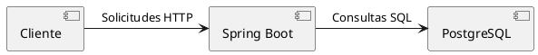

# 🏗️ Plataforma de Gestión Documental para Trámites Urbanísticos


Sistema web completo para la gestión de:
- 📄 Licencias urbanísticas
- 🏢 Otras actuaciones relacionadas
- ✉️ Solicitudes generales

## 🚀 Características Principales
- **Flujos de trabajo** para los 3 tipos de trámites
- **Roles jerárquicos** (Admin, Revisores, Ciudadanos)
- **Seguimiento en tiempo real** de solicitudes
- **Radicación presencial/virtual**

## 🏛️ Arquitectura del Sistema




## 🛠️ Tecnologías Utilizadas
| Área         | Tecnologías                                                                 |
|--------------|----------------------------------------------------------------------------|
| Backend      | Spring Boot 3.1, Spring Security, JPA/Hibernate, JWT                       |
| Base de Datos| PostgreSQL 15                                                              |
| Frontend     | (Especificar si aplica: React/Thymeleaf)                                   |
| Herramientas | Maven, Git, PostgreSQL, AWS S3 (para documentos)                           |

## 📦 Instalación Local
```bash
# 1. Clonar repositorio
git clone https://github.com/jadecol/plataforma-tramites.git

# 2. Configurar base de datos (crear archivo application-local.properties)
spring.datasource.url=jdbc:postgresql://localhost:5432/tramites_db
spring.datasource.username=tu_usuario
spring.datasource.password=tu_contraseña

# 3. Ejecutar
mvn spring-boot:run
```

## 🌐 Despliegue en Producción
```bash
# Ejemplo para AWS EC2
mvn clean package
java -jar target/plataforma-tramites-0.0.1-SNAPSHOT.jar
```

## 🤝 Cómo Contribuir
1. Haz fork del proyecto
2. Crea una rama (`git checkout -b feature/nueva-funcionalidad`)
3. Haz commit de tus cambios (`git commit -m 'Add some feature'`)
4. Haz push a la rama (`git push origin feature/nueva-funcionalidad`)
5. Abre un Pull Request

## 🖼️ Vistas del Sistema

| Login | Dashboard |
|-------|-----------|
|  |  |

*Capturas del sistema en funcionamiento*

## 📄 Licencia
Este proyecto está bajo la licencia MIT. Ver [LICENSE](LICENSE) para más detalles.

---

> ✨ **Nota**: Este sistema está diseñado para las secretarías de planeación y curadurías urbanas de Colombia.